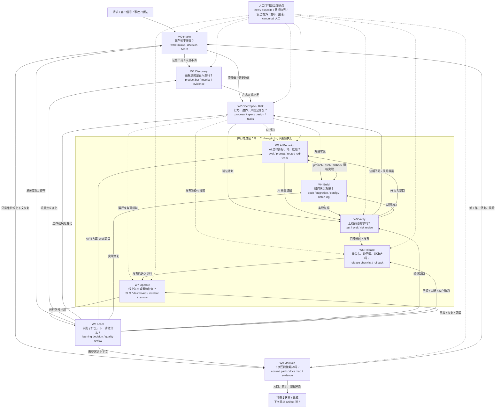
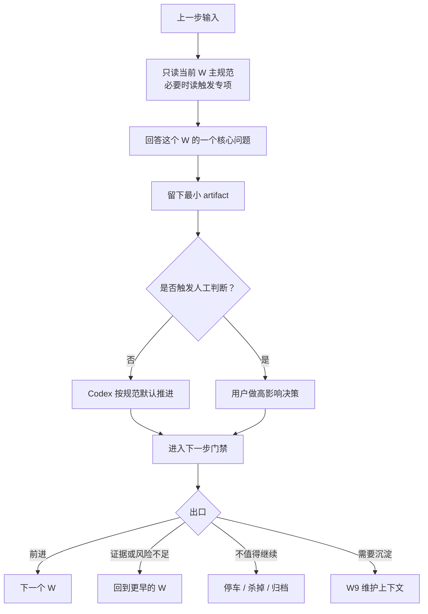

# W0-W9 运转图

这张图说明 W0-W9 不是文档分类，也不是线性瀑布。它更像一套一人公司 AI 研发调度图：W0-W2 决定做什么和边界是什么；W3-W7 可以围绕同一个 OpenSpec change 并行推进；W8/W9 持续把线上信号和上下文回流到下一轮选择。

## 总览



## 单个 W 的内部节奏

单个 W 也不是“做完才允许看下一步”。实际做法是：先判断这个 W 的核心问题，留下能恢复上下文的最小工件；如果相邻 W 的工作已经清楚，就可以并行推进，但关键门禁不能跳过。



## 每个 W 的职责

| W | 核心问题 | 最小产出 | 常见出口 |
| --- | --- | --- | --- |
| W0 Intake | 现在该不该做？ | work-intake、decision-board | W1、W2、W9、停车 |
| W1 Discovery | 要解决的是真问题吗？ | product bet、metrics、feedback evidence | W2、W0 |
| W2 OpenSpec / Risk | 行为、边界、风险是什么？ | proposal、spec、design、tasks | W3、W4、W0 |
| W3 AI Behavior | AI 怎样算好、坏、危险？ | eval、prompt、route、red-team、fallback | W4、W2 |
| W4 Build | 如何落到系统？ | code、migration、config、batch log | W5 |
| W5 Verify | 上线前证据够吗？ | test/eval run、risk review、rollback plan | W6、W2/W3/W4 |
| W6 Release | 能发布、能回滚、能承诺吗？ | release checklist、smoke、rollback、claim evidence | W7 |
| W7 Operate | 线上怎么观察和恢复？ | SLO、dashboard、alert、incident、restore | W8 |
| W8 Learn | 学到了什么，下一步做什么？ | learning decision、quality review、support feedback | W0-W7、W9 |
| W9 Maintain | 下次还能接起来吗？ | docs map、context pack、freshness、evidence、debt review | 完成或 W0-W8 |

## 顺畅性核对

- 入口顺：任何请求先落到 W0；证据不清走 W1，值得推进且有边界风险走 W2，纯维护走 W9。
- 边界顺：W2 是并行区的调度口，不是实现阶段；它把同一个 change 拆给 W3/W4/W5/W6/W7。
- 并行顺：W3/W4/W5 可互相修正；W6/W7 可提前准备，但 W5 没过不能真实发布。
- 回流顺：W8 是学习路由器，能回 W0-W7 的任一步；不是只能回产品或 AI。
- 收口顺：W9 把上下文、证据和索引沉淀成可恢复状态；只有发现新工作、风险或证据缺口时才回到 W0-W8。
- 人审顺：人只卡高影响判断；普通字段、链接、索引、验证和低风险实现由 Codex 与 verifier 推进。

## 并行规则

- W0/W1/W2 是路由和边界层，通常先启动；没有它们，后面的并行会变成散工。
- W3、W4、W5 经常并行：AI 行为设计、实现、测试/eval 会互相修正。
- W6、W7 可以提前准备 release checklist、rollback、SLO、dashboard、runbook，但真实发布要等 W5 门禁。
- W8、W9 不是最后一步才做；运行信号、质量回归、文档和证据可以随时把工作带回 W0-W7。
- 并行不等于跳门禁；每个 W 仍要留下自己的最小 artifact。

## 使用口诀

```text
先定位 W，再只读当前 W；
能并行就并行，但门禁不能省；
先留最小工件，再过关键门禁；
代码完成不算完成，至少走到 W5；
上线后还要 W7/W8，沉淀后才到 W9；
学到新东西，回到 W0 重新选择。
```
